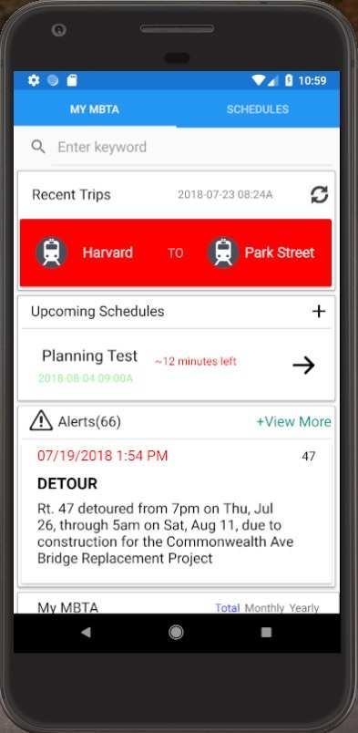
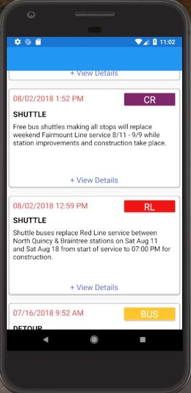
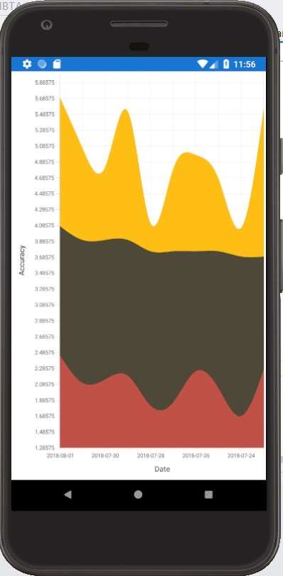
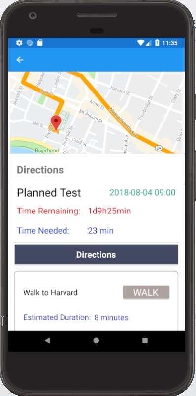

# MBTAManager
Final Project for Harvard Summer School "CSCI S-73 Developing Cross-Platform Mobile Apps With Xamarin"
A cross platform mobile application providing travelling information, alerts and schedule optimizations in Boston.

#### Platform requirements:
**Xamarin.Android**: Windows, Visual Studio  
**Xamarin.iOS**: Windows/macOS, Visual Studio for Mac  
**Xamarin.Forms**: macOS(iOS, Android); Windows(Android, iOS, UWP)  
*Note that if you wish to deploy your project on iOS platform a Mac with Visual Studio for Mac is required.*

49,51,52,53
## App Preview
### Mainpage
Includes recent trip info, upcoming schedules, major alerts.
  

### Alerts
Dispaly alert title, message, time and line info.
  

  
History alert accuracy analysis.
  

### Navigation
Detailed and optimized path based on alerts and google map.
  

